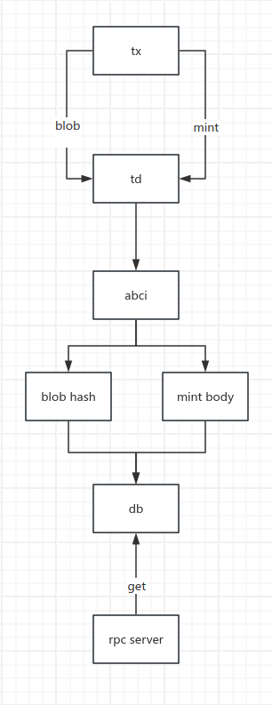

# Design

## flow diagram



## tx data
Uses the same signature mechanism as Ethereum

```jsonc
{
  "type": "blob/mint",
  "body": "",
  "signature": ""
}

// mint body
{
  "nonce": 0,
  "amount": "0x1",
  "address": "0x47102e476Bb96e616756ea7701C227547080Ea48"
}

// blob body
{
  "data": "0x000...",
  "address": "0x47102e476Bb96e616756ea7701C227547080Ea48"
}
```

## rpc 

### get nonce
```jsonc
get /nonce/{address}

resp
{
    "jsonrpc": "2.0",
    "id": 0,
    "error": "",
    "msg": "",
    "data": {
        "code": 0,
        "nonce": 0
    }
}
```

### get balance
```jsonc
get /balance/{address}

resp
{
    "jsonrpc": "2.0",
    "id": 0,
    "error": "",
    "data": {
        "code": 0,
        "balance": "0x0"
    }
}
```

### send blob tx
```jsonc
post /blob
req
{
    "data": "0x...",// must hex data
    "address": "0x..."
}

resp
{
    "jsonrpc": "2.0",
    "id": 0,
    "error": "",
    "data": {
        "code": 0,
        "data": "",
        "log": "",
        "hash": ""
    }
}

```

### calculating gas
```jsonc
get :26657/check_tx?tx=0x

resp
{
  "error": "",
  "result": {
    "code": "0",
    "data": "",
    "log": "",
    "info": "",
    "gas_wanted": "1",
    "gas_used": "0",
    "events": [
      {
        "type": "app",
        "attributes": [
          {
            "key": "YWN0aW9u",
            "value": "c2VuZA==",
            "index": false
          }
        ]
      }
    ],
    "codespace": "bank"
  },
  "id": 0,
  "jsonrpc": "2.0"
}
```